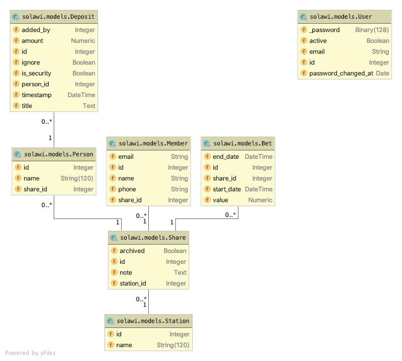

# CSA Share Management [](https://travis-ci.org/k-nut/csa-share-management) [](https://codecov.io/gh/k-nut/csa-share-management)

Internal tool at our CSA (Community supported agriculture) group that helps manage finances.

The frontend is [csa-frontend](https://github.com/k-nut/csa-frontend).

## Setup
Make sure that you have a virtual environment set up for the project.

Install all requirements 
```
pip install -r requirements.txt
```

This app requires a set of environment variables to be defined:

| name                 | description                                                                 | example value                                  |
|:---------------------|:----------------------------------------------------------------------------|:-----------------------------------------------|
| DATABASE_URL         | The URL for the database that the application should use                    | `postgres://postgres@0.0.0.0:5432/solawi`      |
| DATABASE_URL_TEST    | The URL for the database that should be used for tests                      | `postgres://postgres@0.0.0.0:5432/test_solawi` |
| FLASK_DEBUG          | Set to True for better local debugging. Always `False` for production       | `True `                                        |
| FLASK_APP            | The path to the application. Always `solawi/app.py`                         | `solawi/app.py `                               |
| CSA_ACCOUNT_BLZ      | The Bankleitzahl for the account from which deposits should be imported     | `43060967 `                                    |
| CSA_ACCOUNT_IBAN     | The IBAN for the account from which deposits should be imported             | `DE26500105175461841195`                       |
| CSA_ACCOUNT_USERNAME | The username for the bank account from which deposits should be imported    | `example.person `                              |
| CSA_ACCOUNT_PASSWORD | The password for the bank account from which deposits should be imported    | `hunter2`                                      |
| CSA_HBCI_PRODUCT_ID  | The HBCI product id for the application. Fill in [this form](1) to register | `123ABC4567DEF89GHIJKLMNOP`                    |

## Creating db/running migrations
Migrations are managed with [Flask-Migrate](https://flask-migrate.readthedocs.io/en/latest/). 
```bash
flask db upgrade
```

## Running
On the first run, you need to initialize your database. Make sure your environment variables are exported and then run:
```bash
flask db upgrade
```
This  only needs to be done initially and whenever the DB schema changes. 

In order to start the application you have to run:
```bash
flask run
```

## Importing data
Data is imported via the bank's FinTS API. Make sure that you set the correct enviornment
variables for your bank and then run.
```bash
flask import-statements
```
When you deploy the application, you should put this into a cronjob and run it 
daily (or weekly if that is sufficient for your use case).

The `import-statements` command takes a `--interactive/--non-interactive` flag. If it is set to `--non-interactive`
(this is the default), it will raise an exception if the bank requires a TAN for this import to be completed. If this
happens, the command should be re-triggered from the command line with the `--interactive` flag and the PIN should be
put in by the developer. Due to PSD2 regulations this manual import with a PIN will probably have to be done about
once per quarter (but this is at the bank's discretion).

There used to also exist an endpoint to manually import data where users could upload a CSV that the previously
exported from the bank's website. This integration broke when our bank switched backend providers though
and was replaced by the FinTS import. The code was removed in commit [5fa2518b37ce54d728c855f379a758442819f669](https://github.com/k-nut/csa-share-management/commit/5fa2518b37ce54d728c855f379a758442819f669).

## Data Model

A **user** is a user of the application who can log into the system.

A **station** is a place where members can pick up their vegetables. It is important from an organisational perspective mostly.

At every station there are **shares**. A **share** has (multiple) **members**. Members are used to show who a share 
belongs to and to generate members lists for each station. 

A **share** has (multiple) **bets**. A bet is the amount of money that the share promised to pay for a range of time.
As there are shares that take part in the CSA over multiple years, a share can have many bets. Their times should never
overlap though. 

In order to check if the shares all paid their bets properly, **deposits** are saved to the database. A deposit comes
from the bank's exports and records who the payment amount and time. It also can be marked as a security deposit from
which every account should have one at the value of this year's bet.

A deposit is always made by a **person**. A person is the name that shows up in the bank exports. We use it to map entries
in the bank export to shares. In most cases there will probably be a **member** `Jane Doe` and also a person `Jane Doe` 
but sometimes people have different names in their bank accounts than they do in real life or they share one (e.g. the
bank export showing `Jane & John Doe` as a name) so we cannot re-use the member model for this bank specific data.

## Creating users
Users can only be created from the command line. To do so, run:
```bash
flask createuser <email> <password>
```


## Testing
The application comes with a set of tests which can be run with:
```bash
pytest
```
In order to also collect coverage reports, run:
```bash
pytest --cov=./
```

[1]: https://www.hbci-zka.de/register/prod_register.htm

## Maintainers' Responsibilities 
In addition to bug fixes, the CSA Share Management tool maintainer/s have the following responsibilities: 
- Create new Accounts 
- Coordinate imports mit Geli (namely, Geli gets a new PIN on her cell phone every 3 months, after which we have to manually start the import with the new PIN)
- Coordinate end-of-the-year Export for Barny, which is done directly via the Database in Heroku
